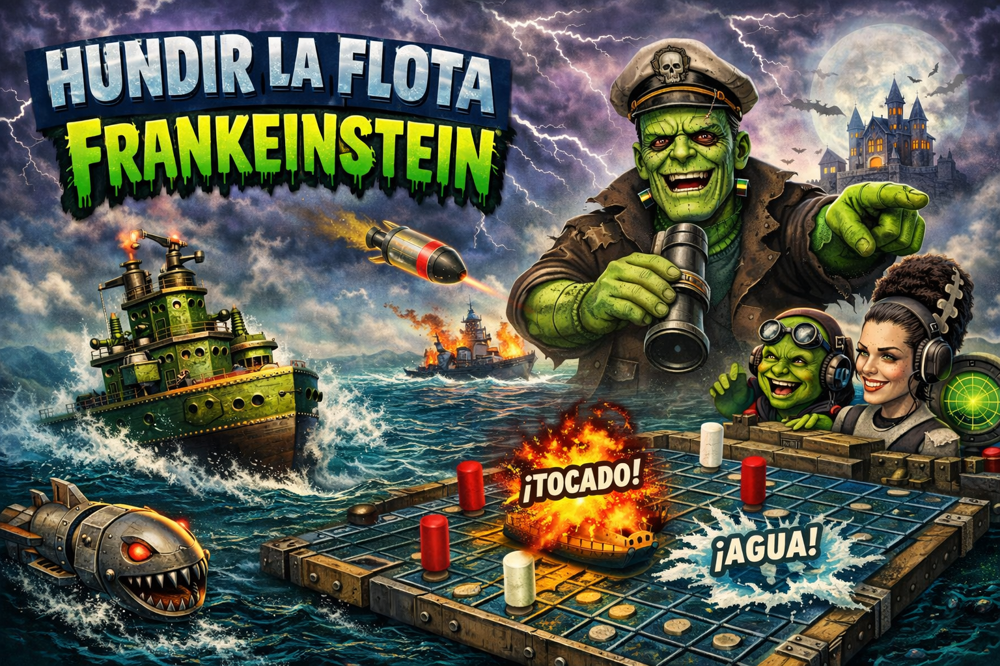

# Hundir la Flota Frankenstein
------------------------------------------------------------------------

**Autor:** Danillo Barros de Souza\
**ORCID:** https://orcid.org/0000-0002-7762-8862
**Website:** https://danillodbs16.github.io/danillosouza/

------------------------------------------------------------------------




**Hundir la Flota Frankenstein** es una versión del clásico juego
**Hundir la Flota (Battleship)** desarrollada en **Python** utilizando
la librería **Tkinter** para la interfaz gráfica. El nombre
**"Frankenstein"** surge porque el juego fue construido a partir de
diferentes bloques de código y módulos desarrollados en distintos
momentos, que posteriormente fueron ensamblados en un único proyecto
funcional, de forma similar al personaje de Frankenstein creado a partir
de distintas partes. El objetivo del juego es hundir todos los barcos
del oponente adivinando sus posiciones en una cuadrícula antes de que el
enemigo haga lo mismo.

------------------------------------------------------------------------
## Requisitos


El juego requiere **Python 3.11 o superior** y las siguientes librerías:

    numpy>=1.24
    pyfxr==0.3.0
    pygame==2.6.1

Se recomienda instalar las dependencias utilizando:

``` bash
pip install -r requirements.txt
```

------------------------------------------------------------------------

## Ejecución del juego

Para ejecutar el juego desde la terminal:

``` bash
python playHLF.py
```

------------------------------------------------------------------------

## Estructura del proyecto

    .
    ├── playHLF.py
    ├── main_game/
    │   ├── facil.py
    │   ├── normal.py
    │   └── dificil.py
    ├── Functions.py
    ├── Sounds.py
    ├── HLF_Frankeinstein.png
    └── requirements.txt

------------------------------------------------------------------------

## Imagen del proyecto

La imagen utilizada en el proyecto es **HLF_Frankeinstein.png**.

**Nota:**\
La imagen fue creada utilizando **IA generativa**.

------------------------------------------------------------------------

## Características

-   Interfaz gráfica con **Tkinter**
-   Diferentes niveles de dificultad
-   Efectos de sonido utilizando **pygame** y **pyfxr**
-   Lógica modular dividida en varios archivos
-   Inspirado en el clásico juego **Hundir la Flota**

------------------------------------------------------------------------

## Licencia

Este proyecto se distribuye con fines **educativos y de aprendizaje en
programación con Python**.
